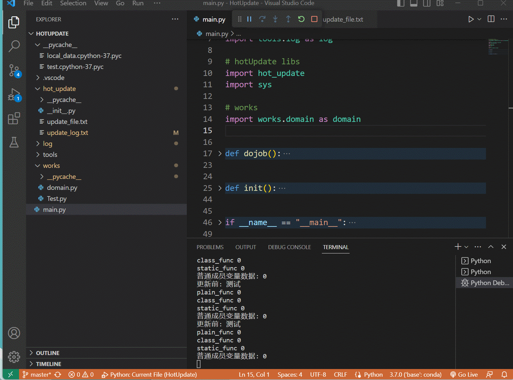

# 服务器代码热更演示



## 新建一个事件派发器  不需要重启服务器 直接热更改

在 channel 文件夹内 新建一个脚本 test.py 或者使用ftp上传到这个文件目录下也可以  以下是channel脚本的标准案例

>服务端 在channel下新建一个test.py 或者ftp上传到此目录下
```python
from flask import jsonify
from flask import send_from_directory
import os
import tools.log as log

# 必须要实现的方法  当你callapi调用当前渠道时 调用此方法
def apply(msg: dict):

    # msg 参数字典 

    return jsonify({
            "code": 404,
            "err": "undefine api."
        })
```


## 然后就可以在本地客户端远程调用你的新脚本API了
>客户端调用命令案例

```python

api = 'https://www.geek7.top:8091/callApi'


# 必填参数
# channel: 渠道 这里填你刚刚在服务器新建的test
# token: 这个是认证码 不做认证可以填时间戳

data = {
    'token' : time.time(),
    'channel':'test',
    'code':829,
    'version': '',
    'region' : '2'
}

# res 拿到的就是服务器端返回的值  
# 是不是非常的easy
res = requests.get(api,data) 


```
